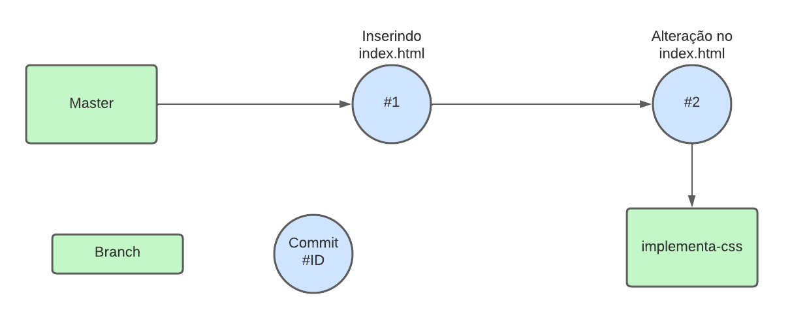
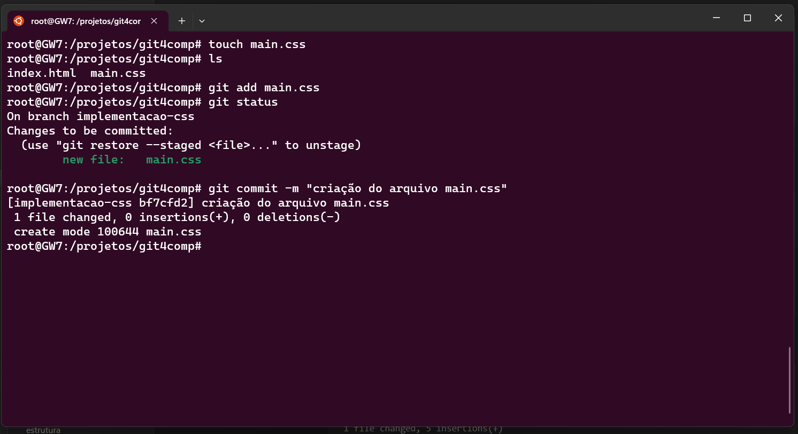
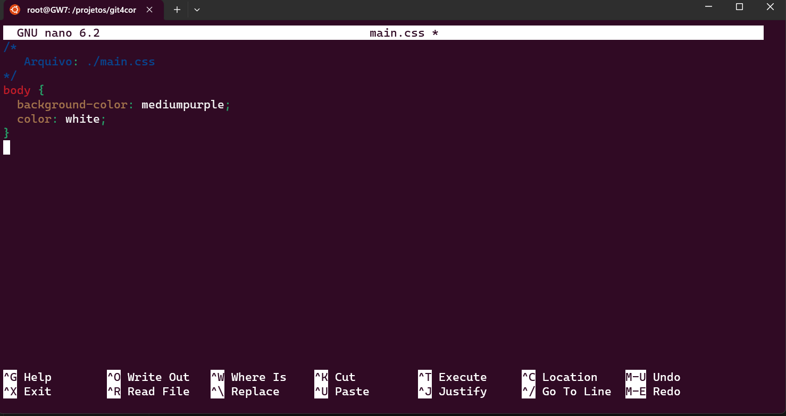
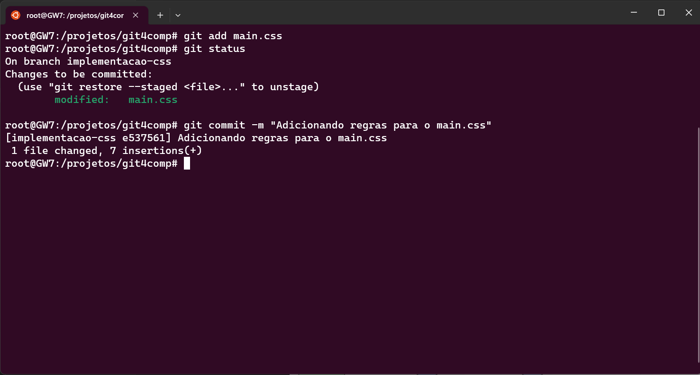

# Branch

Simplificado: _Universo Paralelo_ <br><br>
Podemos dizer que a branch é um universo ou uma realidade alternativa onde em algum ponto irá se juntar com a realidade principal. Achou esse exemplo estranho? Então deixa eu te mostrar uns exemplos.<br>
Pense em um cenário onde seu time encontra um problema que precisa ser resolvido, porém nem sempre há apenas uma única solução para finalizar essa tarefa, certo? É ai que a branch entra para ajudar nessa organização entre os devs.<br>
Continuando nesse cenário hipotético, os desenvolvedores irão criar uma nova vertente do código partindo da branch **master** (branch principal gerada a partir do primeiro commit), assim criando a branch implementacao-css.

A tarefa hipotética é: implementar uma regra CSS especifica na nossa index.html.

Porém, antes precisamos criar uma nova branch e para isso iremos usar o comando **git checkout** com o primeiro argumento **-b (branch)** e o segundo sendo o nome da nova branch.

```
$ git checkout -b implementacao-css
Switched to a new branch 'implementacao-css'
$ git branch
  master
* implementacao-css
```



Podemos ver que agora estamos em um outro universo diferente do principal (master) e toda e qualquer alteração feita nessa nova branch não afetará nenhuma outra dentro do projeto.<br><br>
Tá, mas o que eu faço com essa branch? A ideia é você ter liberdade para criar coisas novas sem alterar onde está tudo funcionando (master).<br>
Vamos fazer algumas alterações no nosso projeto dentro dessa nova branch:

- Crie um novo arquivo na raiz do projeto chamado main.css
- Commite esse arquivo com a mensagem "criação de arquivo main.css"

```
$ touch main.css
$ git add main.css
$ git commit -m "criação de arquivo main.css"
[implementacao-css f56f97a] criando arquivo main.css
 1 file changed, 0 insertions(+), 0 deletions(-)
 create mode 100644 main.css
```



Após isso iremos fazer outro commit para adicionar uma regra css simples a esse arquivo. Apenas entre no arquivo criado e adicione alguma regra a tag body:

Usando o nano:

```
nano main.css
```



```css
/*
   Arquivo: ./main.css
*/
body {
  background-color: mediumpurple;
  color: white;
}
```

Salve o arquivo alterado com os mesmos comandos feitos anteriormente e faça mais um commit:

```
$ git add main.css
$ git commit -m "adicionando regras para o main.css"
[implementacao-css ab4a625] adicionando regras para o main.css
 1 file changed, 5 insertions(+)
```



Podemos ver na imagem abaixo que há duas linhas de tempo diferentes que não se conflitaram (até o momento) e podem ser alteradas sem que ninguém atropele o código do outro no projeto, evitando conflitos e sempre mantendo tudo que é feito documentado dentro do repositório.


Ir para [3.5. Merge](../3-comandos/merge.md)