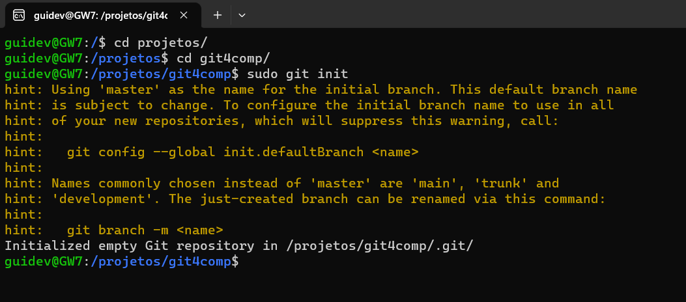

# Repositório

Simplificado: _Pasta do Projeto_ <br><br>
Repositório é a pasta raiz do seu projeto, não é algo complicado, e é bem simples de ser feito.<br><br>
Crie uma pasta vazia e digite o comando **git init**:

```
$ mkdir git4comp
$ cd git4comp
$ git init
Initialized empty Git repository in ~/git4comp/.git/
```

Exemplo do terminal abaixo:



Simples, não é mesmo?!

Ir para: [3.2. Config](config.md)