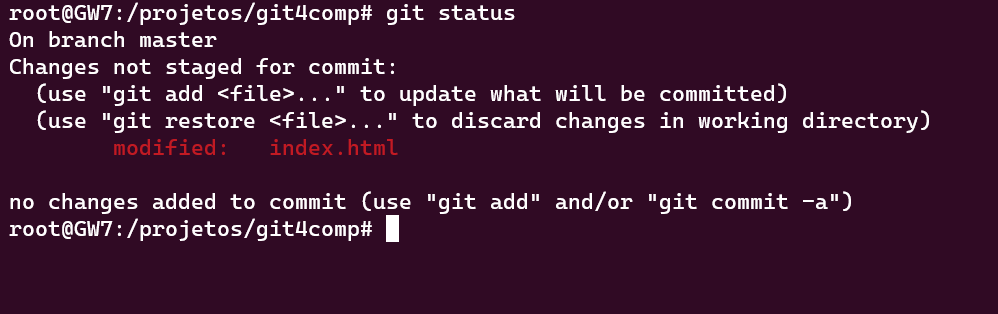

# Status

Você viu que sempre uso nos prints de exemplos, o git status, mas por que usamos ?

É um comando simples para saber qual branch você se encontra, quais arquivos foram alterados e também quais arquivos já estão prontos para serem commitados. Apenas execute o mesmo depois de fazer qualquer alteração e você irá ver algum retorno parecido com o exemplo abaixo:

```
$ git status
No ramo master
Mudanças a serem submetidas:
  (use "git reset HEAD <file>..." to unstage)
	modified:   main.css
Arquivos não monitorados:
  (utilize "git add <arquivo>..." para incluir o que será submetido)
	index.html
```

Esse comando vai te dar uma visão geral de tudo que está acontecendo no repositório que vá afetar algo ou não no seu próximo commit.



Ir para: [3.7. Diff](../3-comandos/diff.md)
